```{r setup, include=FALSE}
knitr::opts_chunk$set(
  echo = FALSE,
  warning = FALSE,
  message = FALSE
)

library(tidyverse)
library(knitr)
library(scales)
```

<style>
body {
  font-size: 16px;
  line-height: 1.7;
}

h1, h2, h3 {
  font-weight: 700;
}

.callout {
  background-color: #F8FAFC;
  border-left: 5px solid #2563EB;
  padding: 15px 20px;
  margin: 20px 0;
  border-radius: 6px;
}

.insight {
  background-color: #ECFDF5;
  border-left: 5px solid #14B8A6;
  padding: 15px 20px;
  margin: 20px 0;
  border-radius: 6px;
}

.warning {
  background-color: #FFFBEB;
  border-left: 5px solid #F59E0B;
  padding: 15px 20px;
  margin: 20px 0;
  border-radius: 6px;
}
</style>

# Introduction

Ce rapport présente une analyse métier des données **Open Medic AMELI 2025**.

L'objectif est de transformer les données de remboursement de médicaments en informations utiles pour la décision : dépenses, volumes, classes thérapeutiques, profils de consommation, régions, spécialités médicales et impact budgétaire.

<div class="callout">
<strong>Objectif du rapport :</strong> proposer une lecture claire, visuelle et opérationnelle des remboursements de médicaments en France.
</div>

# 1. Vue d'ensemble du marché

## Question métier

Quelle est l'ampleur du marché des médicaments remboursés observé dans les données Open Medic ?

```{r}
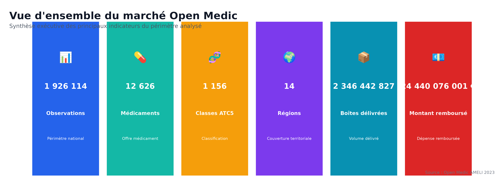
```

<div class="insight">
Le périmètre analysé est conséquent : plus de <strong>2,4 millions d'observations</strong>, <strong>12 501 médicaments distincts</strong>, <strong>1 173 classes ATC5</strong> et <strong>14 régions</strong>.  
Les données couvrent plus de <strong>2,3 milliards de boîtes délivrées</strong> et près de <strong>27,8 milliards d'euros remboursés</strong>.  
Le jeu de données est donc suffisamment riche pour produire une lecture nationale des dépenses pharmaceutiques.
</div>

# 2. Médicaments les plus remboursés

## Question métier

Quels médicaments représentent les montants de remboursement les plus élevés ?

```{r}
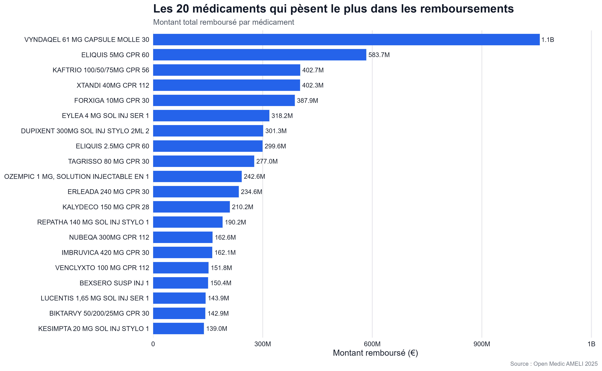
```

<div class="insight">
Les remboursements sont fortement concentrés sur quelques médicaments. <strong>VYNDAQEL</strong> dépasse 1 milliard d'euros remboursés, loin devant les autres médicaments.  
Ces produits doivent être considérés comme prioritaires dans toute analyse de maîtrise des dépenses, car une variation de leur prix ou de leur volume peut avoir un effet budgétaire important.
</div>

# 3. Médicaments les plus délivrés

## Question métier

Quels médicaments sont les plus consommés en nombre de boîtes ?

```{r}
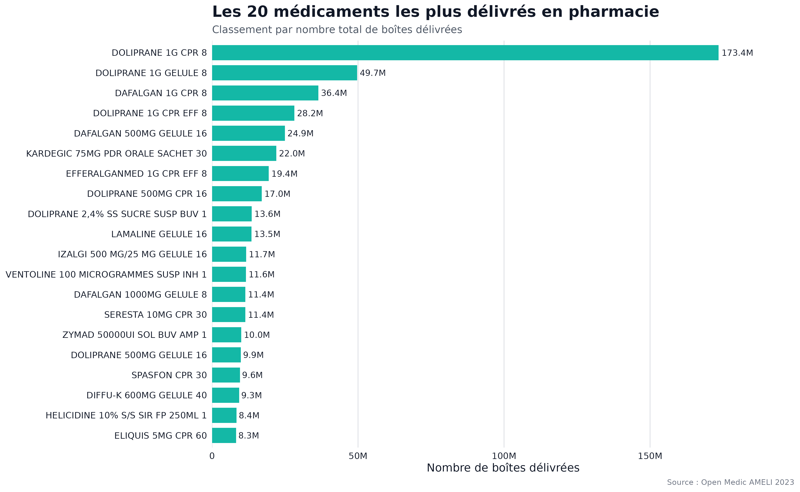
```

<div class="insight">
Les médicaments les plus délivrés sont principalement des traitements courants, notamment le paracétamol avec <strong>DOLIPRANE</strong> et <strong>DAFALGAN</strong>.  
Cela montre que les médicaments les plus consommés ne sont pas nécessairement ceux qui coûtent le plus à l'Assurance Maladie.
</div>

# 4. Remboursement versus volume

## Question métier

Les médicaments les plus remboursés sont-ils aussi les plus délivrés ?

```{r}
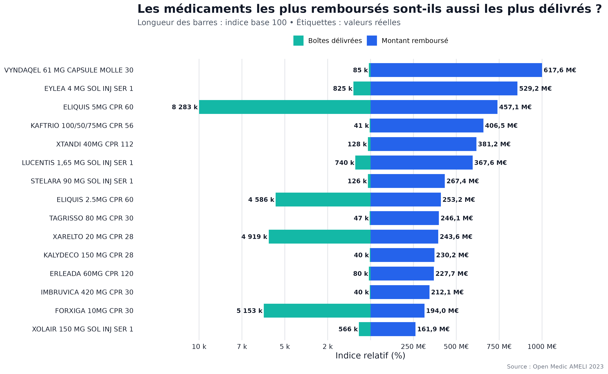
```

<div class="insight">
La comparaison confirme un décalage important entre volume et remboursement. Certains médicaments comme <strong>FORXIGA</strong> ou <strong>ELIQUIS</strong> combinent un fort volume et un poids financier important.  
À l'inverse, certains traitements très remboursés ont un volume relativement faible, ce qui suggère un coût unitaire élevé.
</div>

# 5. Classes thérapeutiques

## Question métier

Quelles classes thérapeutiques concentrent les remboursements ?

```{r}
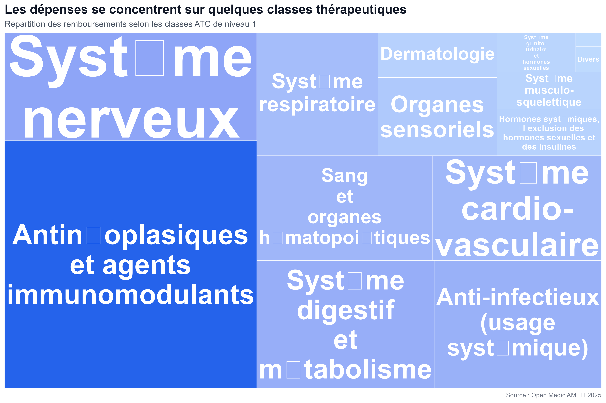
```

<div class="insight">
Les remboursements sont fortement portés par quelques grandes classes thérapeutiques. Les <strong>antinéoplasiques et agents immunomodulants</strong> représentent la première classe en montant remboursé.  
Cette concentration traduit le poids économique des traitements lourds, notamment en oncologie, immunologie et maladies chroniques.
</div>

# 6. Médicaments génériques

## Question métier

Quelle est la place des médicaments génériques dans les remboursements ?

```{r}
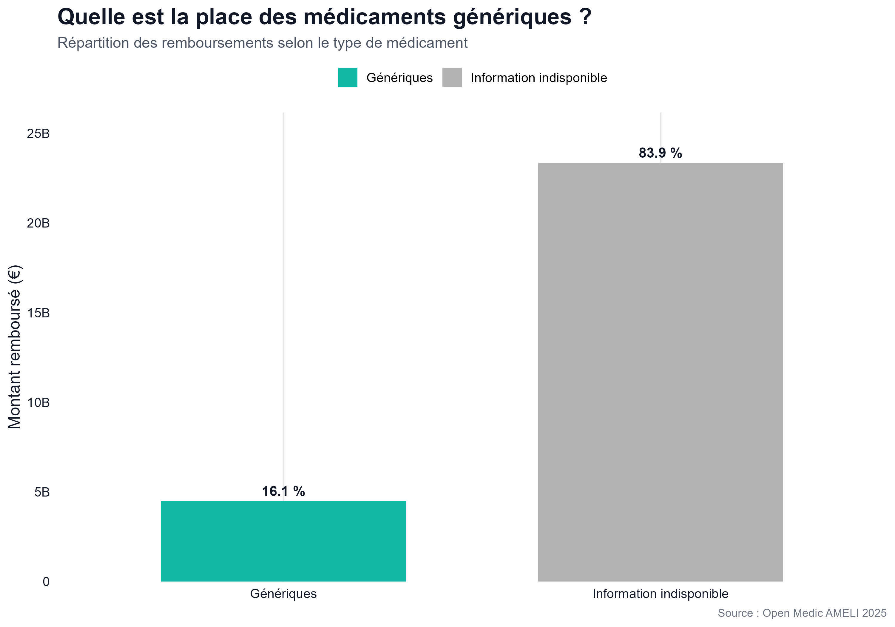
```

<div class="insight">
La part des médicaments identifiés comme génériques représente environ <strong>16,1 %</strong> des remboursements.  
La forte proportion d'information indisponible invite toutefois à rester prudent : l'analyse des génériques dépend fortement de la qualité du codage de cette variable.
</div>

# 7. Analyse âge et sexe

## Question métier

Comment les remboursements se répartissent-ils selon l'âge et le sexe ?

```{r}
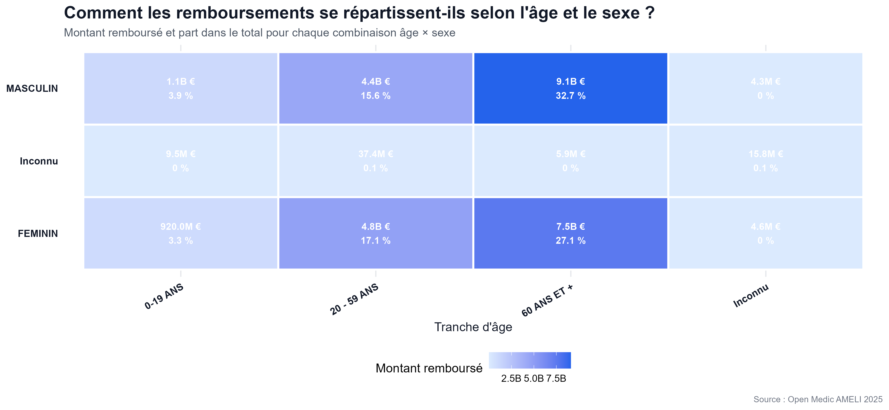
```

<div class="insight">
Les remboursements sont principalement concentrés chez les bénéficiaires de <strong>60 ans et plus</strong>, aussi bien chez les hommes que chez les femmes.  
Cette structure est cohérente avec une consommation médicamenteuse plus élevée avec l'âge, notamment pour les maladies chroniques.
</div>

# 8. Analyse territoriale

## Question métier

Les dépenses sont-elles réparties de manière homogène entre les régions ?

```{r}
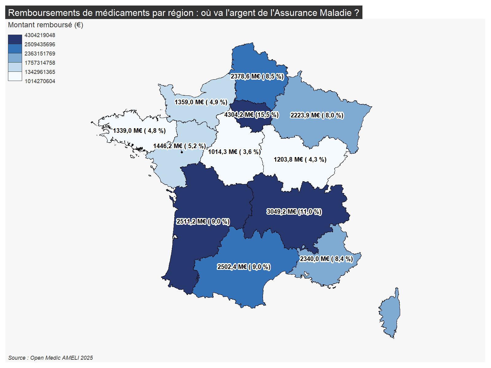
```

<div class="insight">
La carte met en évidence des écarts régionaux importants. L'<strong>Île-de-France</strong>, l'<strong>Auvergne-Rhône-Alpes</strong>, la <strong>Nouvelle-Aquitaine</strong> et l'<strong>Occitanie</strong> figurent parmi les régions les plus contributrices.  
Ces écarts doivent cependant être interprétés avec prudence, car ils reflètent aussi la taille de population régionale.
</div>

# 9. Spécialités médicales

## Question métier

Quelles spécialités médicales génèrent les plus forts remboursements ?

```{r}
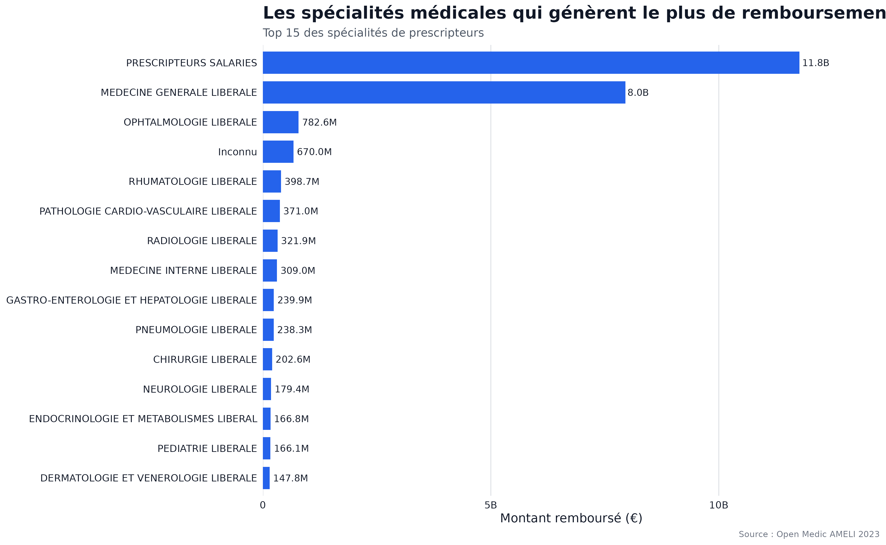
```

<div class="insight">
Les <strong>prescripteurs salariés</strong> et la <strong>médecine générale libérale</strong> concentrent une part très importante des remboursements.  
Cela confirme le rôle central des structures hospitalières et de la médecine générale dans la prescription des médicaments remboursés.
</div>

# 10. Concentration des remboursements

## Question métier

Les remboursements sont-ils concentrés sur une faible proportion de médicaments ?

```{r}
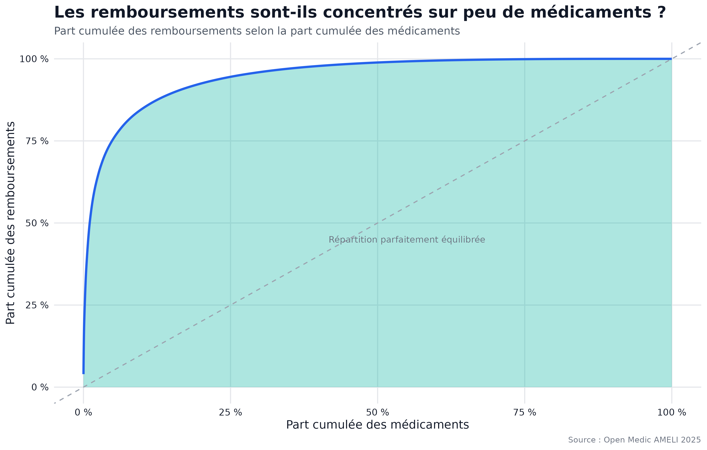
```

<div class="insight">
La courbe montre une forte concentration des remboursements : une faible proportion de médicaments explique une grande partie des dépenses.  
Pour un décideur, cela signifie que le suivi prioritaire d'un nombre limité de médicaments peut permettre de mieux piloter une part importante du budget.
</div>

# 11. Impact budgétaire

## Question métier

Quels médicaments présentent un impact budgétaire élevé ?

```{r}
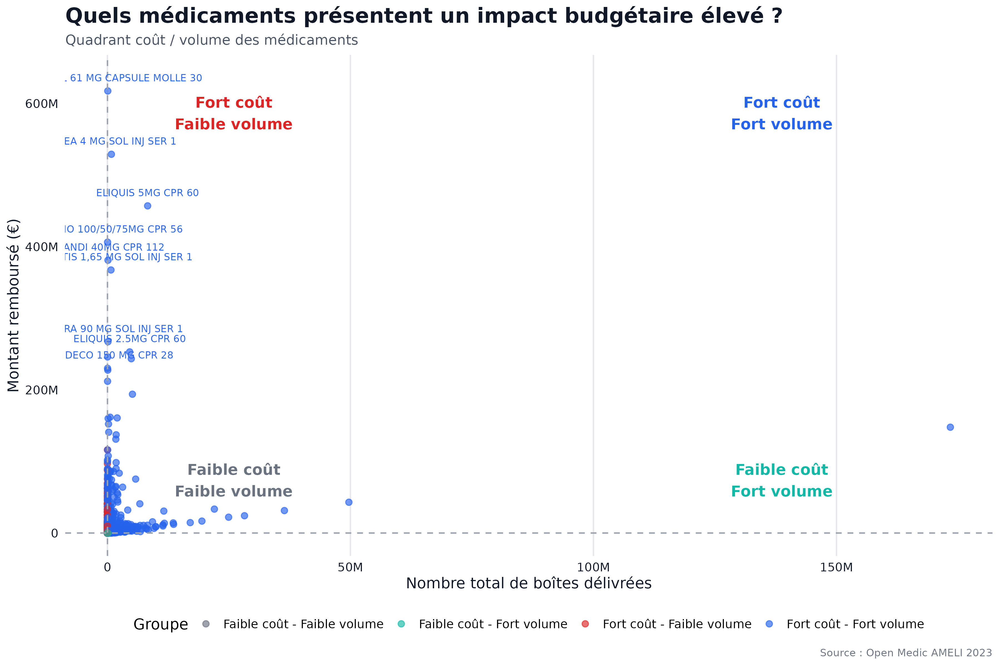
```

<div class="insight">
Le quadrant coût-volume distingue quatre profils de médicaments. Les traitements situés en haut à gauche sont particulièrement sensibles : ils génèrent de forts remboursements malgré un faible volume.  
Ce sont des médicaments à surveiller en priorité dans une logique de pilotage budgétaire.
</div>

# 12. Niveaux d'impact budgétaire

## Question métier

Quelle part des observations présente un impact budgétaire faible, moyen, fort ou critique ?

```{r}
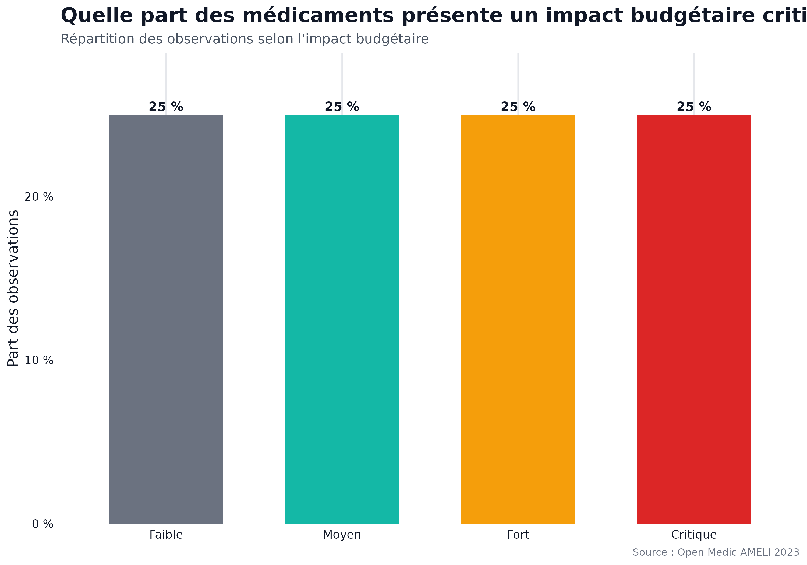
```

<div class="insight">
La répartition en quatre niveaux d'impact budgétaire est équilibrée car elle repose sur des quartiles.  
Cette classification est utile pour segmenter le portefeuille de médicaments et prioriser les analyses : faible, moyen, fort ou critique.
</div>

# 13. Coût moyen par boîte

## Question métier

Quels médicaments présentent le remboursement moyen par boîte le plus élevé ?

```{r}
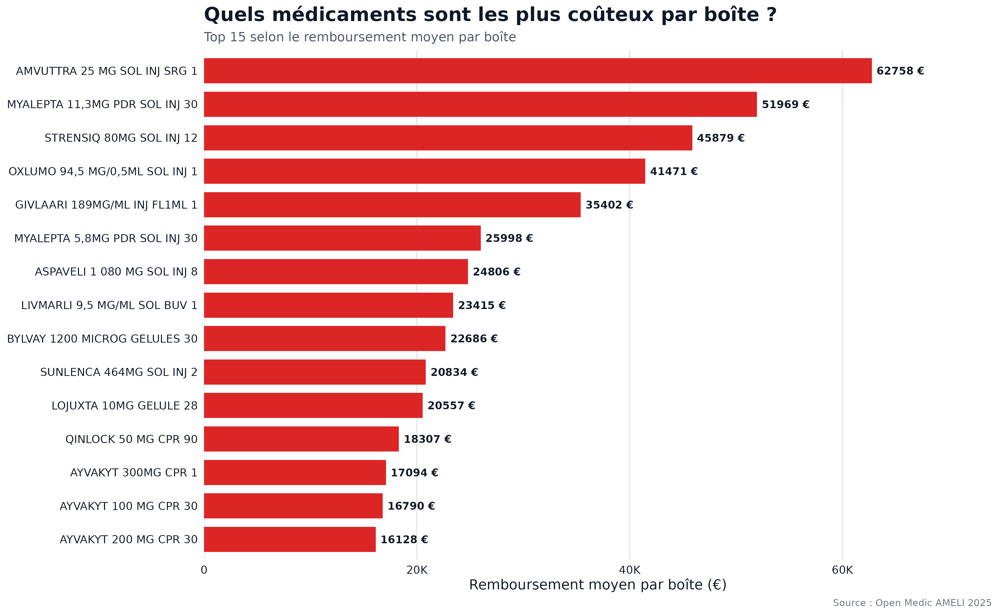
```

<div class="insight">
Les médicaments les plus coûteux par boîte atteignent des niveaux très élevés, parfois supérieurs à <strong>60 000 € par boîte remboursée</strong>.  
Ces produits correspondent probablement à des traitements spécialisés, innovants ou destinés à des pathologies rares. Ils méritent une analyse spécifique distincte des médicaments de consommation courante.
</div>

# Synthèse des enseignements

Cette analyse met en évidence plusieurs enseignements clés :

- Les dépenses de médicaments sont fortement concentrées sur un nombre limité de produits.
- Les médicaments les plus délivrés ne sont pas forcément les plus coûteux.
- Les classes thérapeutiques liées aux traitements lourds concentrent une part importante des remboursements.
- Les remboursements augmentent fortement avec l'âge.
- Les différences territoriales existent, mais doivent être analysées en tenant compte de la population régionale.
- Les médicaments à fort coût et faible volume doivent être suivis en priorité.

<div class="callout">
<strong>Message clé :</strong> le pilotage des dépenses pharmaceutiques nécessite de distinguer volume de consommation, coût unitaire, classe thérapeutique et impact budgétaire.
</div>

# Limites de l'analyse

<div class="warning">
Cette analyse repose sur des données agrégées. Elle ne permet pas d'analyser les trajectoires individuelles des patients ni les prescriptions au niveau patient.  
Certaines variables présentent également des modalités inconnues ou indisponibles, notamment pour l'analyse des génériques.  
Enfin, les comparaisons régionales doivent être complétées par des indicateurs rapportés à la population pour éviter une lecture uniquement liée à la taille des régions.
</div>

# Conclusion

Les données Open Medic permettent de produire une lecture riche et opérationnelle des remboursements de médicaments en France.

L'analyse montre que les dépenses ne dépendent pas uniquement du volume délivré. Certains médicaments sont très consommés mais peu coûteux, tandis que d'autres sont peu délivrés mais fortement remboursés.

Cette distinction est essentielle pour orienter les politiques de maîtrise des dépenses, identifier les médicaments à fort impact budgétaire et préparer des analyses plus avancées.

<div class="callout">
<strong>Ouverture :</strong><br>

Cette étude constitue une première étape dans la compréhension des remboursements de médicaments en France. Elle fait émerger plusieurs pistes d'investigation, notamment sur les médicaments à fort impact budgétaire, les disparités territoriales et les classes thérapeutiques les plus contributrices, qui pourront faire l'objet d'analyses complémentaires.
</div>